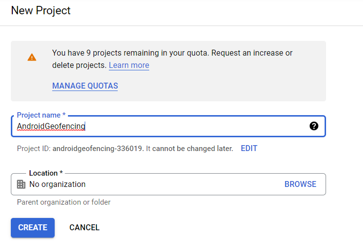
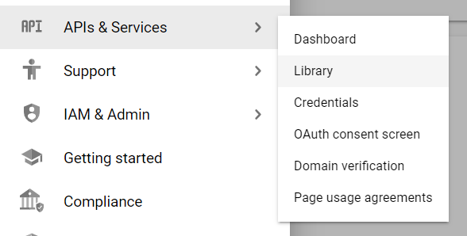
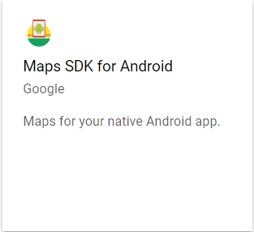
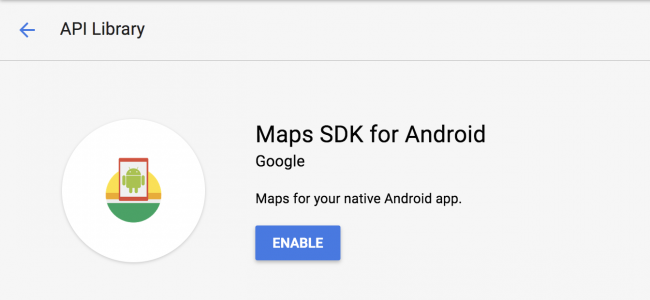
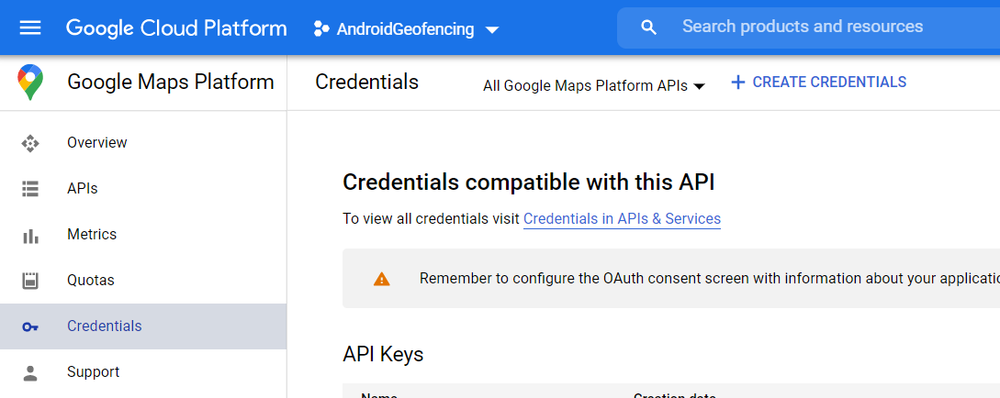
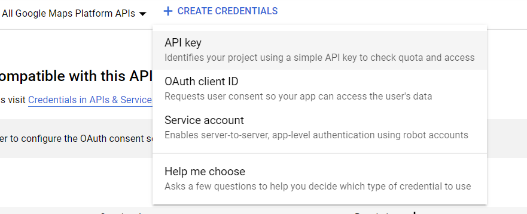

Geofencing is a feature in android that allow you to react to an event when the user enter or exit a specific area. This feature have been used by google in their Google Maps application and you should be familiar with it, when you in some area that have a POI(Point Of Interest) in Google Maps it will send you a notification when you enter that area and if you click on it the application will ask you some questions about those place.

Here we will try to imitate that feature but with our own message and POI. Wihout further ado let's try to make it.

First you need to get a Google Maps API key to use it's feature in Android.

1. Open Google Cloud Platform and [create a new project](https://console.cloud.google.com/projectcreate)

   

   Feel free to leave the *Project Name* as is or change it as you like, and then click **Create**.
2. Open the menu by clicking 3 lines icon on the top left corner and select **APIs & Services** > **Library** 

   
3. Select **Maps SDK for Android**

   
4. Click Enable, or Manage if it's already enabled.

   
5. Select **Credential** on the left menu and click **Create Credential** button and select **API key**

   

   

   Save that API key because it will be used later in you anroid project.

Now create a new project in Android Studio, and select Basic Activity template in Android Studio. And then you need to create a new kotlin file named AndroidGeofenceApp.kt with the content like below

```kotlin
package com.muhammadsayuti.androidgeofencing

import android.app.Application

class AndroidGeofencingApp : Application() {

    private lateinit var repository: ReminderRepository

    override fun onCreate() {
        super.onCreate()
        repository = ReminderRepository(this)
    }

    fun getRepository() = repository
}
```

Next you need to use this AndroidGeofencingApp in application, add required permissions, activity, receiver, service and your Google Maps API key in AndroidManifest.xml file.

```xml
<?xml version="1.0" encoding="utf-8"?>
<manifest xmlns:android="http://schemas.android.com/apk/res/android"
  package="com.muhammadsayuti.androidgeofencing">

  <uses-permission android:name="android.permission.ACCESS_COARSE_LOCATION" />
  <uses-permission android:name="android.permission.ACCESS_FINE_LOCATION" />
  <uses-permission android:name="android.permission.ACCESS_BACKGROUND_LOCATION" />
  <uses-permission android:name="android.permission.INTERNET" />

  <application
    android:allowBackup="true"
    android:icon="@mipmap/ic_launcher"
    android:label="@string/app_name"
    android:roundIcon="@mipmap/ic_launcher_round"
    android:supportsRtl="true"
    android:theme="@style/Theme.AndroidGeofencing"
    android:name=".AndroidGeofencingApp">
    <activity
      android:name=".MainActivity"
      android:exported="true"
      android:label="@string/app_name"
      android:theme="@style/Theme.AndroidGeofencing.NoActionBar">
      <intent-filter>
        <action android:name="android.intent.action.MAIN" />

        <category android:name="android.intent.category.LAUNCHER" />
      </intent-filter>
    </activity>
    <activity android:name=".NewReminderActivity" />
    <receiver
      android:name=".GeofenceBroadcastReceiver"
      android:enabled="true"
      android:exported="true" />
    <service
      android:name=".GeofenceJobIntentService"
      android:exported="true"
      android:permission="android.permission.BIND_JOB_SERVICE" />
    <meta-data
      android:name="com.google.android.geo.API_KEY"
      android:value="YOUR_API_KEY" />
  </application>

</manifest>
```

Next add some dependencies that we will use later in your app build.gradle.

```groovy
implementation 'com.google.android.gms:play-services-maps:18.0.0'
implementation 'com.google.android.gms:play-services-location:18.0.0'
implementation 'com.karumi:dexter:4.2.0'
implementation 'com.google.code.gson:gson:2.8.6'
```

Now add kotlin-android-extensions plugin in your build gradle

```groovy
plugins {
    id 'com.android.application'
    id 'kotlin-android'
    id 'kotlin-android-extensions'
}
```

After that create a new file called Reminder.kt with the content like below.

```kotlin
package com.muhammadsayuti.androidgeofencing

import com.google.android.gms.maps.model.LatLng
import java.util.*

data class Reminder(val id: String = UUID.randomUUID().toString(),
                    var latLng: LatLng?,
                    var radius: Double?,
                    var message: String?)
```

Next we need to create a file to add or remove geofencing, in this tutorial i only use SharedPreference as a storage to save all geofencing as json string.
Create file called ReminderRepository.kt with the content like below

```kotlin
package com.muhammadsayuti.androidgeofencing

import android.Manifest
import android.app.PendingIntent
import android.content.Context
import android.content.Intent
import android.content.pm.PackageManager
import android.util.Log
import androidx.core.content.ContextCompat
import com.google.android.gms.location.Geofence
import com.google.android.gms.location.GeofencingRequest
import com.google.android.gms.location.LocationServices
import com.google.android.gms.tasks.OnSuccessListener
import com.google.gson.Gson


class ReminderRepository(private val context: Context) {

  companion object {
    private const val PREFS_NAME = "ReminderRepository"
    private const val REMINDERS = "REMINDERS"
  }

  private val preferences = context.getSharedPreferences(PREFS_NAME, Context.MODE_PRIVATE)
  private val gson = Gson()
  private val geofencingClient = LocationServices.getGeofencingClient(context)
  private val geofencePendingIntent: PendingIntent by lazy {
    val intent = Intent(context, GeofenceBroadcastReceiver::class.java)
    PendingIntent.getBroadcast(
      context,
      0,
      intent,
      PendingIntent.FLAG_UPDATE_CURRENT
    )
  }

  fun add(
    reminder: Reminder,
    success: () -> Unit,
    failure: (error: String) -> Unit
  ) {

    val geofence = buildGeofence(reminder)
    if (geofence != null
      && ContextCompat.checkSelfPermission(
        context,
        Manifest.permission.ACCESS_FINE_LOCATION
      ) == PackageManager.PERMISSION_GRANTED
    ) {
      geofencingClient
        .addGeofences(buildGeofencingRequest(geofence), geofencePendingIntent)
        .addOnSuccessListener {
          saveAll(getAll() + reminder)
          success()
        }
        .addOnFailureListener {
          failure(GeofenceErrorMessages.getErrorString(context, it))
        }
    }
  }

  private fun buildGeofence(reminder: Reminder): Geofence? {
    val latitude = reminder.latLng?.latitude
    val longitude = reminder.latLng?.longitude
    val radius = reminder.radius

    if (latitude != null && longitude != null && radius != null) {
      return Geofence.Builder()
        .setRequestId(reminder.id)
        .setCircularRegion(
          latitude,
          longitude,
          radius.toFloat()
        )
        .setTransitionTypes(Geofence.GEOFENCE_TRANSITION_ENTER)
        .setExpirationDuration(Geofence.NEVER_EXPIRE)
        .build()
    }

    return null
  }

  private fun buildGeofencingRequest(geofence: Geofence): GeofencingRequest {
    return GeofencingRequest.Builder()
      .setInitialTrigger(0)
      .addGeofences(listOf(geofence))
      .build()
  }

  fun remove(
    reminder: Reminder,
    success: () -> Unit,
    failure: (error: String) -> Unit
  ) {
    geofencingClient
      .removeGeofences(listOf(reminder.id))
      .addOnSuccessListener {
        saveAll(getAll() - reminder)
        success()
      }
      .addOnFailureListener {
        failure(GeofenceErrorMessages.getErrorString(context, it))
      }
  }

  private fun saveAll(list: List<Reminder>) {
    preferences
      .edit()
      .putString(REMINDERS, gson.toJson(list))
      .apply()
  }

  fun getAll(): List<Reminder> {
    if (preferences.contains(REMINDERS)) {
      val remindersString = preferences.getString(REMINDERS, null)
      val arrayOfReminders = gson.fromJson(
        remindersString,
        Array<Reminder>::class.java
      )
      if (arrayOfReminders != null) {
        return arrayOfReminders.toList()
      }
    }
    return listOf()
  }

  fun get(requestId: String?) = getAll().firstOrNull { it.id == requestId }

  fun getLast() = getAll().lastOrNull()

}
```

Next add some add some strings to your string.xml resouce file

```xml
  <string name="instruction_where_description">Where do you want to be reminded?</string>
  <string name="instruction_where_subtitle_description">Drag the map to set the location</string>
  <string name="instruction_radius_description">Choose the radius</string>
  <string name="instruction_message_description">Enter the message</string>
  <string name="continue_description">Continue</string>
  <string name="error_required">Required</string>
  <string name="message_hint">We arrived! :]</string>
  <string name="radius_description">%1$s meters</string>

  <string name="reminder_removal_alert">Remove reminder?</string>
  <string name="reminder_removal_alert_positive">OK</string>
  <string name="reminder_removal_alert_negative">Cancel</string>

  <string name="reminder_added_success">Reminder added!</string>
  <string name="reminder_removed_success">Reminder removed!</string>

  <string name="marker_content_description">Marker</string>

  <string name="geofence_unknown_error">
        Unknown error: the Geofence service is not available now.
  </string>
  <string name="geofence_not_available">
    Geofence service is not available now. Go to Settings>Location>Mode and choose High accuracy.
  </string>
  <string name="geofence_too_many_geofences">
    Your app has registered too many geofences.
  </string>
  <string name="geofence_too_many_pending_intents">
    You have provided too many PendingIntents to the addGeofences() call.
  </string>
```

Now create a new helper file to get error message from resource string above, create a file called GeofenceErrorMessage.kt with the content like below

```kotlin
package com.muhammadsayuti.androidgeofencing

import android.content.Context
import com.google.android.gms.common.api.ApiException
import com.google.android.gms.location.GeofenceStatusCodes

object GeofenceErrorMessages {
  fun getErrorString(context: Context, e: Exception): String {
    return if (e is ApiException) {
      getErrorString(context, e.statusCode)
    } else {
      context.resources.getString(R.string.geofence_unknown_error)
    }
  }

  fun getErrorString(context: Context, errorCode: Int): String {
    val resources = context.resources
    return when (errorCode) {
      GeofenceStatusCodes.GEOFENCE_NOT_AVAILABLE ->
        resources.getString(R.string.geofence_not_available)

      GeofenceStatusCodes.GEOFENCE_TOO_MANY_GEOFENCES ->
        resources.getString(R.string.geofence_too_many_geofences)

      GeofenceStatusCodes.GEOFENCE_TOO_MANY_PENDING_INTENTS ->
        resources.getString(R.string.geofence_too_many_pending_intents)

      else -> resources.getString(R.string.geofence_unknown_error)
    }
  }
}
```

After that create a file called BaseActivity.kt to be used in MainActivity.

```kotlin
package com.muhammadsayuti.androidgeofencing

import androidx.appcompat.app.AppCompatActivity

abstract class BaseActivity : AppCompatActivity() {
    fun getRepository() = (application as AndroidGeofencingApp).getRepository()
}
```

Now change the content of your MainActivity.kt to look like below

```kotlin
package com.muhammadsayuti.androidgeofencing

import android.Manifest
import android.annotation.SuppressLint
import android.app.Activity
import android.content.Context
import android.content.Intent
import android.content.pm.PackageManager
import android.location.Criteria
import android.location.LocationManager
import android.os.Build
import android.os.Bundle
import android.util.Log
import android.view.View
import androidx.appcompat.app.AlertDialog
import androidx.coordinatorlayout.widget.CoordinatorLayout
import androidx.core.app.ActivityCompat
import androidx.core.content.ContextCompat
import com.google.android.gms.maps.CameraUpdateFactory
import com.google.android.gms.maps.GoogleMap
import com.google.android.gms.maps.OnMapReadyCallback
import com.google.android.gms.maps.SupportMapFragment
import com.google.android.gms.maps.model.LatLng
import com.google.android.gms.maps.model.Marker
import com.google.android.material.floatingactionbutton.FloatingActionButton
import com.google.android.material.snackbar.Snackbar
import com.karumi.dexter.Dexter
import com.karumi.dexter.PermissionToken
import com.karumi.dexter.listener.PermissionDeniedResponse
import com.karumi.dexter.listener.PermissionGrantedResponse
import com.karumi.dexter.listener.PermissionRequest
import com.karumi.dexter.listener.single.PermissionListener

import kotlinx.android.synthetic.main.activity_main.*

class MainActivity : BaseActivity(), OnMapReadyCallback, GoogleMap.OnMarkerClickListener {

  companion object {
    private const val NEW_REMINDER_REQUEST_CODE = 330
    private const val EXTRA_LAT_LNG = "EXTRA_LAT_LNG"

    fun newIntent(context: Context, latLng: LatLng): Intent {
      val intent = Intent(context, MainActivity::class.java)
      intent.putExtra(EXTRA_LAT_LNG, latLng)
      return intent
    }
  }

  private var map: GoogleMap? = null

  private lateinit var locationManager: LocationManager

  override fun onCreate(savedInstanceState: Bundle?) {
    super.onCreate(savedInstanceState)
    setContentView(R.layout.activity_main)

    val mapFragment = supportFragmentManager
      .findFragmentById(R.id.map) as SupportMapFragment
    mapFragment.getMapAsync(this)

    newReminder.visibility = View.GONE
    currentLocation.visibility = View.GONE
    newReminder.setOnClickListener {
      map?.run {
        val intent = NewReminderActivity.newIntent(
          this@MainActivity,
          cameraPosition.target,
          cameraPosition.zoom
        )
        startActivityForResult(intent, NEW_REMINDER_REQUEST_CODE)
      }
    }

    locationManager = getSystemService(Context.LOCATION_SERVICE) as LocationManager

    Dexter.withActivity(this)
      .withPermission(Manifest.permission.ACCESS_FINE_LOCATION)
      .withListener(object : PermissionListener {
        @SuppressLint("MissingPermission")
        override fun onPermissionGranted(response: PermissionGrantedResponse) {

          if (Build.VERSION.SDK_INT >= Build.VERSION_CODES.Q) {
            Dexter.withActivity(this@MainActivity)
              .withPermission(Manifest.permission.ACCESS_BACKGROUND_LOCATION)
              .withListener(object : PermissionListener {
                @SuppressLint("MissingPermission")
                override fun onPermissionGranted(response: PermissionGrantedResponse) {
                  onMapAndPermissionReady()
                }

                override fun onPermissionDenied(response: PermissionDeniedResponse) {
                  if (response.isPermanentlyDenied) {
                    // open device settings when the permission is
                    // denied permanently
                    //                            openSettings()
                  }
                }

                override fun onPermissionRationaleShouldBeShown(
                  permission: PermissionRequest?,
                  token: PermissionToken
                ) {
                  token.continuePermissionRequest()
                }
              }).check()
          } else {
            onMapAndPermissionReady()
          }
        }

        override fun onPermissionDenied(response: PermissionDeniedResponse) {
          if (response.isPermanentlyDenied) {
            // open device settings when the permission is
            // denied permanently
//                            openSettings()
          }
        }

        override fun onPermissionRationaleShouldBeShown(
          permission: PermissionRequest?,
          token: PermissionToken
        ) {
          token.continuePermissionRequest()
        }
      }).check()
  }

  override fun onActivityResult(requestCode: Int, resultCode: Int, data: Intent?) {
    super.onActivityResult(requestCode, resultCode, data)
    if (requestCode == NEW_REMINDER_REQUEST_CODE && resultCode == Activity.RESULT_OK) {
      showReminders()

      val reminder = getRepository().getLast()
      map?.moveCamera(CameraUpdateFactory.newLatLngZoom(reminder!!.latLng!!, 15f))

      Snackbar.make(main, R.string.reminder_added_success, Snackbar.LENGTH_LONG).show()
    }
  }

  private fun onMapAndPermissionReady() {
    if (map != null
      && ContextCompat.checkSelfPermission(
        this,
        Manifest.permission.ACCESS_FINE_LOCATION
      )
      == PackageManager.PERMISSION_GRANTED
    ) {
      map?.isMyLocationEnabled = true
      newReminder.visibility = View.VISIBLE
      currentLocation.visibility = View.VISIBLE

      currentLocation.setOnClickListener {
        val bestProvider = locationManager.getBestProvider(Criteria(), false)
        if (bestProvider != null) {
          val location = locationManager.getLastKnownLocation(bestProvider)
          if (location != null) {
            val latLng = LatLng(location.latitude, location.longitude)
            map?.animateCamera(CameraUpdateFactory.newLatLngZoom(latLng, 15f))
          }
        }
      }

      showReminders()

      centerCamera()
    }
  }

  private fun centerCamera() {
    if (intent.extras != null) {
      val bundle = intent.extras!!
      if (bundle.containsKey(EXTRA_LAT_LNG)) {
        val latLng = bundle.get(EXTRA_LAT_LNG) as LatLng
        map?.moveCamera(CameraUpdateFactory.newLatLngZoom(latLng, 15f))
      }
    }
  }

  private fun showReminders() {
    map?.run {
      clear()
      for (reminder in getRepository().getAll()) {
        showReminderInMap(this@MainActivity, this, reminder)
      }
    }
  }

  override fun onMapReady(googleMap: GoogleMap) {
    map = googleMap
    map?.run {
      uiSettings.isMyLocationButtonEnabled = false
      uiSettings.isMapToolbarEnabled = false
      setOnMarkerClickListener(this@MainActivity)
    }

    onMapAndPermissionReady()
  }

  override fun onMarkerClick(marker: Marker): Boolean {
    val reminder = getRepository().get(marker.tag as String)

    if (reminder != null) {
      showReminderRemoveAlert(reminder)
    }

    return true
  }

  private fun showReminderRemoveAlert(reminder: Reminder) {
    val alertDialog = AlertDialog.Builder(this).create()
    alertDialog.run {
      setMessage(getString(R.string.reminder_removal_alert))
      setButton(
        AlertDialog.BUTTON_POSITIVE,
        getString(R.string.reminder_removal_alert_positive)
      ) { dialog, _ ->
        removeReminder(reminder)
        dialog.dismiss()
      }
      setButton(
        AlertDialog.BUTTON_NEGATIVE,
        getString(R.string.reminder_removal_alert_negative)
      ) { dialog, _ ->
        dialog.dismiss()
      }
      show()
    }
  }

  private fun removeReminder(reminder: Reminder) {
    getRepository().remove(
      reminder,
      success = {
        showReminders()
        Snackbar.make(main, R.string.reminder_removed_success, Snackbar.LENGTH_LONG).show()
      },
      failure = {
        Snackbar.make(main, it, Snackbar.LENGTH_LONG).show()
      })
  }
}
```

Next is to change your layout activity_main.xml file to look like below

```xml
<?xml version="1.0" encoding="utf-8"?>
<androidx.coordinatorlayout.widget.CoordinatorLayout
  xmlns:android="http://schemas.android.com/apk/res/android"
  xmlns:app="http://schemas.android.com/apk/res-auto"
  xmlns:tools="http://schemas.android.com/tools"
  android:id="@+id/main"
  android:layout_width="match_parent"
  android:layout_height="match_parent"
  tools:context=".MainActivity">

  <fragment
    android:id="@+id/map"
    android:name="com.google.android.gms.maps.SupportMapFragment"
    class="com.google.android.gms.maps.SupportMapFragment"
    android:layout_width="match_parent"
    android:layout_height="match_parent" />

  <LinearLayout
    android:layout_width="wrap_content"
    android:layout_height="wrap_content"
    android:layout_gravity="bottom|end"
    android:layout_margin="@dimen/fab_margin"
    android:orientation="vertical"
    app:layout_dodgeInsetEdges="bottom">

    <com.google.android.material.floatingactionbutton.FloatingActionButton
      android:id="@+id/currentLocation"
      android:layout_width="wrap_content"
      android:layout_height="wrap_content"
      android:layout_margin="@dimen/fab_margin"
      app:srcCompat="@drawable/ic_baseline_my_location_24px" />

    <com.google.android.material.floatingactionbutton.FloatingActionButton
      android:id="@+id/newReminder"
      android:layout_width="wrap_content"
      android:layout_height="wrap_content"
      android:layout_margin="@dimen/fab_margin"
      app:srcCompat="@drawable/ic_baseline_add_24px" />
  </LinearLayout>


</androidx.coordinatorlayout.widget.CoordinatorLayout>
```

Now we will create a new activity to let user choose a location, set radius and set a message when user enter that area. Create a new file called NewReminderActivity.kt with the content like below

```kotlin
package com.muhammadsayuti.androidgeofencing

import android.Manifest
import android.app.Activity
import android.content.Context
import android.content.Intent
import android.os.Build
import android.os.Bundle
import android.util.Log
import android.view.View
import android.widget.SeekBar
import com.google.android.gms.maps.CameraUpdateFactory
import com.google.android.gms.maps.GoogleMap
import com.google.android.gms.maps.OnMapReadyCallback
import com.google.android.gms.maps.SupportMapFragment
import com.google.android.gms.maps.model.LatLng
import com.google.android.material.snackbar.Snackbar
import kotlinx.android.synthetic.main.activity_new_reminder.*
import kotlin.math.roundToInt


class NewReminderActivity : BaseActivity(), OnMapReadyCallback {

  private lateinit var map: GoogleMap

  private var reminder = Reminder(latLng = null, radius = null, message = null)

  private val radiusBarChangeListener = object : SeekBar.OnSeekBarChangeListener {
    override fun onStartTrackingTouch(seekBar: SeekBar?) {}

    override fun onStopTrackingTouch(seekBar: SeekBar?) {}

    override fun onProgressChanged(seekBar: SeekBar?, progress: Int, fromUser: Boolean) {
      updateRadiusWithProgress(progress)

      showReminderUpdate()
    }
  }

  private fun updateRadiusWithProgress(progress: Int) {
    val radius = getRadius(progress)
    reminder.radius = radius
    radiusDescription.text = getString(R.string.radius_description, radius.roundToInt().toString())
  }

  companion object {
    private const val EXTRA_LAT_LNG = "EXTRA_LAT_LNG"
    private const val EXTRA_ZOOM = "EXTRA_ZOOM"

    fun newIntent(context: Context, latLng: LatLng, zoom: Float): Intent {
      val intent = Intent(context, NewReminderActivity::class.java)
      intent
          .putExtra(EXTRA_LAT_LNG, latLng)
          .putExtra(EXTRA_ZOOM, zoom)
      return intent
    }
  }

  override fun onCreate(savedInstanceState: Bundle?) {
    super.onCreate(savedInstanceState)
    setContentView(R.layout.activity_new_reminder)

    val mapFragment = supportFragmentManager
        .findFragmentById(R.id.map) as SupportMapFragment
    mapFragment.getMapAsync(this)

    instructionTitle.visibility = View.GONE
    instructionSubtitle.visibility = View.GONE
    radiusBar.visibility = View.GONE
    radiusDescription.visibility = View.GONE
    message.visibility = View.GONE

    supportActionBar?.setDisplayHomeAsUpEnabled(true)
  }

  override fun onSupportNavigateUp(): Boolean {
    finish()
    return true
  }

  override fun onMapReady(googleMap: GoogleMap) {
    map = googleMap
    map.uiSettings.isMapToolbarEnabled = false

    centerCamera()

    showConfigureLocationStep()
  }

  private fun centerCamera() {
    val latLng = intent.extras!!.get(EXTRA_LAT_LNG) as LatLng
    val zoom = intent.extras!!.get(EXTRA_ZOOM) as Float
    map.moveCamera(CameraUpdateFactory.newLatLngZoom(latLng, zoom))
  }

  private fun showConfigureLocationStep() {
    marker.visibility = View.VISIBLE
    instructionTitle.visibility = View.VISIBLE
    instructionSubtitle.visibility = View.VISIBLE
    radiusBar.visibility = View.GONE
    radiusDescription.visibility = View.GONE
    message.visibility = View.GONE
    instructionTitle.text = getString(R.string.instruction_where_description)
    next.setOnClickListener {
      reminder.latLng = map.cameraPosition.target
      showConfigureRadiusStep()
    }

    showReminderUpdate()
  }

  private fun showConfigureRadiusStep() {
    marker.visibility = View.GONE
    instructionTitle.visibility = View.VISIBLE
    instructionSubtitle.visibility = View.GONE
    radiusBar.visibility = View.VISIBLE
    radiusDescription.visibility = View.VISIBLE
    message.visibility = View.GONE
    instructionTitle.text = getString(R.string.instruction_radius_description)
    next.setOnClickListener {
      showConfigureMessageStep()
    }
    radiusBar.setOnSeekBarChangeListener(radiusBarChangeListener)
    updateRadiusWithProgress(radiusBar.progress)

    map.animateCamera(CameraUpdateFactory.zoomTo(15f))

    showReminderUpdate()
  }

  private fun getRadius(progress: Int) = 100 + (2 * progress.toDouble() + 1) * 100

  private fun showConfigureMessageStep() {
    marker.visibility = View.GONE
    instructionTitle.visibility = View.VISIBLE
    instructionSubtitle.visibility = View.GONE
    radiusBar.visibility = View.GONE
    radiusDescription.visibility = View.GONE
    message.visibility = View.VISIBLE
    instructionTitle.text = getString(R.string.instruction_message_description)
    next.setOnClickListener {
      hideKeyboard(this, message)

      reminder.message = message.text.toString()

      if (reminder.message.isNullOrEmpty()) {
        message.error = getString(R.string.error_required)
      } else {
        addReminder(reminder)
      }
    }
    message.requestFocusWithKeyboard()

    showReminderUpdate()
  }

  private fun addReminder(reminder: Reminder) {
    getRepository().add(reminder,
        success = {
          Log.e("ReminderRepository", "adding new geofence success")
          setResult(Activity.RESULT_OK)
          finish()
        },
        failure = {
          Log.e("ReminderRepository", "adding new geofence failed")
          Snackbar.make(main, it, Snackbar.LENGTH_LONG).show()
        })
  }

  private fun showReminderUpdate() {
    map.clear()
    showReminderInMap(this, map, reminder)
  }
}
```

Now for the layout of this activity create a new xml file called activity_new_reminder.xml in your layout directory.

```xml
<?xml version="1.0" encoding="utf-8"?>
<androidx.coordinatorlayout.widget.CoordinatorLayout xmlns:android="http://schemas.android.com/apk/res/android"
  xmlns:app="http://schemas.android.com/apk/res-auto"
  xmlns:tools="http://schemas.android.com/tools"
  android:id="@+id/main"
  android:layout_width="match_parent"
  android:layout_height="match_parent"
  tools:context=".NewReminderActivity">

  <fragment
    android:id="@+id/map"
    android:name="com.google.android.gms.maps.SupportMapFragment"
    android:layout_width="match_parent"
    android:layout_height="match_parent" />

  <ImageView
    android:id="@+id/marker"
    android:layout_width="48dp"
    android:layout_height="48dp"
    android:layout_gravity="center"
    android:layout_marginBottom="24dp"
    android:contentDescription="@string/marker_content_description"
    app:srcCompat="@drawable/ic_twotone_location_on_48px" />

  <LinearLayout
    android:id="@+id/container"
    android:layout_width="match_parent"
    android:layout_height="wrap_content"
    android:layout_gravity="bottom"
    android:background="#000"
    android:orientation="vertical">

    <TextView
      android:id="@+id/instructionTitle"
      android:layout_width="wrap_content"
      android:layout_height="wrap_content"
      android:layout_marginLeft="16dp"
      android:layout_marginTop="16dp"
      android:layout_marginRight="16dp"
      android:layout_marginBottom="8dp"
      android:textColor="#fff"
      android:textSize="18sp"
      tools:text="@string/instruction_where_description" />

    <TextView
      android:id="@+id/instructionSubtitle"
      android:layout_width="wrap_content"
      android:layout_height="wrap_content"
      android:layout_marginLeft="16dp"
      android:layout_marginRight="16dp"
      android:layout_marginBottom="8dp"
      android:text="@string/instruction_where_subtitle_description" />

    <SeekBar
      android:id="@+id/radiusBar"
      android:layout_width="match_parent"
      android:layout_height="wrap_content"
      android:layout_marginLeft="2dp"
      android:layout_marginRight="2dp"
      android:max="4"
      android:progress="2" />

    <TextView
      android:id="@+id/radiusDescription"
      android:layout_width="wrap_content"
      android:layout_height="wrap_content"
      android:layout_gravity="start|bottom"
      android:layout_marginLeft="16dp"
      android:layout_marginTop="4dp"
      android:layout_marginRight="16dp"
      android:layout_marginBottom="4dp"
      tools:text="100 meters" />

    <EditText
      android:id="@+id/message"
      android:layout_width="match_parent"
      android:layout_height="wrap_content"
      android:layout_marginLeft="13dp"
      android:layout_marginRight="13dp"
      android:layout_marginBottom="8dp"
      android:hint="@string/message_hint"
      android:imeOptions="actionDone"
      android:inputType="textCapSentences"
      android:maxLines="1" />

    <Button
      android:id="@+id/next"
      android:layout_width="match_parent"
      android:layout_height="wrap_content"
      android:layout_gravity="center_horizontal"
      android:layout_marginLeft="16dp"
      android:layout_marginTop="8dp"
      android:layout_marginRight="16dp"
      android:layout_marginBottom="8dp"
      android:background="@drawable/bg_button"
      android:foreground="?attr/selectableItemBackground"
      android:text="@string/continue_description"
      android:textColor="@color/colorAccent" />

  </LinearLayout>

</androidx.coordinatorlayout.widget.CoordinatorLayout>
```

After that create a file called Utils.kt to save all our utility functions.

```kotlin
package com.muhammadsayuti.androidgeofencing

import android.app.NotificationChannel
import android.app.NotificationManager
import android.app.PendingIntent
import android.content.Context
import android.content.res.Resources
import android.graphics.Bitmap
import android.graphics.Canvas
import android.os.Build
import android.view.View
import android.view.inputmethod.InputMethodManager
import android.widget.EditText
import androidx.annotation.DrawableRes
import androidx.core.app.NotificationCompat
import androidx.core.app.TaskStackBuilder
import androidx.core.content.ContextCompat
import androidx.core.content.res.ResourcesCompat
import com.google.android.gms.maps.GoogleMap
import com.google.android.gms.maps.model.*

fun EditText.requestFocusWithKeyboard() {
  val imm = context.getSystemService(Context.INPUT_METHOD_SERVICE) as InputMethodManager

  if (!hasFocus()) {
    requestFocus()
  }

  post { imm.showSoftInput(this, InputMethodManager.SHOW_FORCED) }
}

fun hideKeyboard(context: Context, view: View) {
  val keyboard = context.getSystemService(Context.INPUT_METHOD_SERVICE) as InputMethodManager
  keyboard.hideSoftInputFromWindow(view.windowToken, 0)
}

fun vectorToBitmap(resources: Resources, @DrawableRes id: Int): BitmapDescriptor {
  val vectorDrawable = ResourcesCompat.getDrawable(resources, id, null)
  val bitmap = Bitmap.createBitmap(vectorDrawable!!.intrinsicWidth,
      vectorDrawable.intrinsicHeight, Bitmap.Config.ARGB_8888)
  val canvas = Canvas(bitmap)
  vectorDrawable.setBounds(0, 0, canvas.width, canvas.height)
  vectorDrawable.draw(canvas)
  return BitmapDescriptorFactory.fromBitmap(bitmap)
}

fun showReminderInMap(context: Context,
                      map: GoogleMap,
                      reminder: Reminder) {
  if (reminder.latLng != null) {
    val latLng = reminder.latLng as LatLng
    val vectorToBitmap = vectorToBitmap(context.resources, R.drawable.ic_twotone_location_on_48px)
    val marker = map.addMarker(MarkerOptions().position(latLng).icon(vectorToBitmap))
    marker?.tag = reminder.id
    if (reminder.radius != null) {
      val radius = reminder.radius as Double
      map.addCircle(CircleOptions()
          .center(reminder.latLng!!)
          .radius(radius)
          .strokeColor(ContextCompat.getColor(context, R.color.colorAccent))
          .fillColor(ContextCompat.getColor(context, R.color.colorReminderFill)))
    }
  }
}

private const val NOTIFICATION_CHANNEL_ID = BuildConfig.APPLICATION_ID + ".channel"

fun sendNotification(context: Context, message: String, latLng: LatLng) {
  val notificationManager = context
      .getSystemService(Context.NOTIFICATION_SERVICE) as NotificationManager

  if (Build.VERSION.SDK_INT >= Build.VERSION_CODES.O
      && notificationManager.getNotificationChannel(NOTIFICATION_CHANNEL_ID) == null) {
    val name = context.getString(R.string.app_name)
    val channel = NotificationChannel(NOTIFICATION_CHANNEL_ID,
        name,
        NotificationManager.IMPORTANCE_DEFAULT)

    notificationManager.createNotificationChannel(channel)
  }

  val intent = MainActivity.newIntent(context.applicationContext, latLng)

  val stackBuilder = TaskStackBuilder.create(context)
      .addParentStack(MainActivity::class.java)
      .addNextIntent(intent)
  val notificationPendingIntent = stackBuilder
      .getPendingIntent(getUniqueId(), PendingIntent.FLAG_UPDATE_CURRENT)

  val notification = NotificationCompat.Builder(context, NOTIFICATION_CHANNEL_ID)
      .setSmallIcon(R.mipmap.ic_launcher)
      .setContentTitle(message)
      .setContentIntent(notificationPendingIntent)
      .setAutoCancel(true)
      .build()

  notificationManager.notify(getUniqueId(), notification)
}

private fun getUniqueId() = ((System.currentTimeMillis() % 10000).toInt())
```

There is 2 step left, now create a file called GeofenceJobIntentService.kt, this is the file that will handle the event when the user enter specific area and send a notification to the user.

```kotlin
package com.muhammadsayuti.androidgeofencing

import android.content.Context
import android.content.Intent
import android.util.Log
import androidx.core.app.JobIntentService
import com.google.android.gms.location.Geofence
import com.google.android.gms.location.GeofencingEvent

class GeofenceJobIntentService : JobIntentService() {

  companion object {
    private const val LOG_TAG = "GeoTrIntentService"

    private const val JOB_ID = 573

    fun enqueueWork(context: Context, intent: Intent) {
      enqueueWork(
          context,
          GeofenceJobIntentService::class.java, JOB_ID,
          intent)
    }
  }

  override fun onHandleWork(intent: Intent) {
    val geofencingEvent = GeofencingEvent.fromIntent(intent)
    if (geofencingEvent.hasError()) {
      val errorMessage = GeofenceErrorMessages.getErrorString(this,
          geofencingEvent.errorCode)
      Log.e(LOG_TAG, errorMessage)
      return
    }

    handleEvent(geofencingEvent)
  }

  private fun handleEvent(event: GeofencingEvent) {
    if (event.geofenceTransition == Geofence.GEOFENCE_TRANSITION_ENTER) {
      val reminder = getFirstReminder(event.triggeringGeofences)
      val message = reminder?.message
      val latLng = reminder?.latLng
      if (message != null && latLng != null) {
        sendNotification(this, message, latLng)
      }
    }
  }

  private fun getFirstReminder(triggeringGeofences: List<Geofence>): Reminder? {
    val firstGeofence = triggeringGeofences[0]
    return (application as AndroidGeofencingApp).getRepository().get(firstGeofence.requestId)
  }
}
```

The last step is to create a BroadcastReceiver to retrieve the broadcast and execute our GeofenceJobIntentService.

```kotlin
package com.muhammadsayuti.androidgeofencing

import android.content.BroadcastReceiver
import android.content.Context
import android.content.Intent
import android.util.Log

class GeofenceBroadcastReceiver : BroadcastReceiver() {
  override fun onReceive(context: Context, intent: Intent) {
    GeofenceJobIntentService.enqueueWork(context, intent)
  }
}
```


That's it, to test the app it's better that you use mock location app like [Mock GPS](https://play.google.com/store/apps/details?id=net.marlove.mockgps&hl=en) to make it easier to test it.